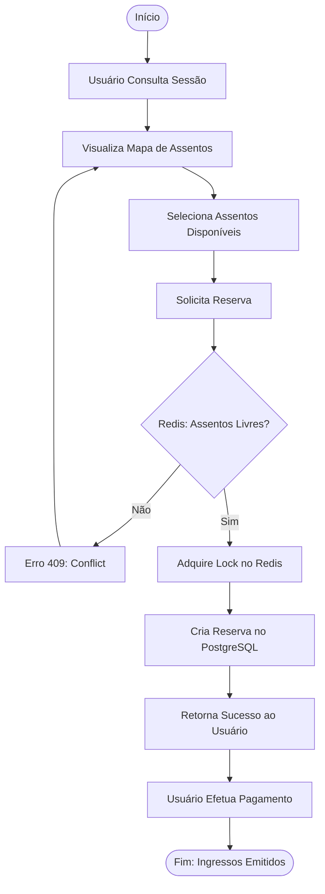

# Cinema Ticket API - StarSoft Challenge

Esta é uma API REST de venda de ingressos de cinema com alta concorrêcia controle de condições de corrida, construída com NestJS, Prisma, Redis e Kafka. Desenvolvida para atender o Desafio Técnico da StarSoft para Desenvolvedor Backend.

- **Desenvolvedor**: Marcos Vinícius Pedreira Vieira
- **Email**: viniciuspv.si@gmail.com

---

## Visualização do swagger da API em ambiente de produção

- **Swagger**: https://apistarsoft.vvsistemas.com.br/api-docs


## Tecnologias

- **Node.js & NestJS**: Framework robusto para escalabilidade.
- **PostgreSQL**: Banco de dados relacional para persistência segura.
- **Redis**: Cache distribuído e **Pesimistic Locks** para controle de concorrência.
- **Kafka**: Mensageria para processamento assíncrono de eventos (Reservas, Pagamentos, Expiração).
- **Prisma ORM**: Execução de **Transações Atômicas** em áreas críticas + **Optimist Lock**.
- **Docker & Docker Compose**: Ambiente de desenvolvimento containerizado.
- **CI/CD Pipeline**: Integração contínua e entrega contínua com GitHub Actions.


---

## Decisões de Arquitetura & Soluções de Concorrência

### 1. Race Conditions & Double Booking
Para impedir que dois usuários comprem o mesmo assento simultaneamente:
- **Distributed Locks (Redis)**: Antes de tocar no banco, a API adquire um lock (`lock:seat:{id}`) no Redis. Se falhar, retorna 409 Conflict imediatamente.
- **Transações Atômicas (Prisma)**: A criação da reserva e a atualização dos status dos assentos ocorrem dentro de uma `prisma.$transaction`.

### 2. Deadlocks
- **Ordenação de Recursos**: Para evitar que a Thread A trave o Assento 1 e espere o 2, enquanto a Thread B tem o 2 e espera o 1, implementei a **ordenação dos IDs dos assentos** antes de solicitar os locks no Redis.

### 3. Expiração de Reservas (TTL)
- **Cron Job**: Um serviço (`ReservationExpirationService`) roda a cada 5 segundos buscando reservas onde `expiresAt < NOW()`.
- **Estratégia**: Libera os assentos no banco e emite um evento `ReservationExpired` no Kafka.

### 4. Mensageria (Kafka)
- Decidi desacoplar o fluxo principal de tarefas secundárias (notificações, analytics) emitindo eventos como `reservation.created`, `payment.confirmed`, etc.

---

## Diagramas da Solução

### Fluxo Simplificado de Compra



### Arquitetura de Infraestrutura (Cluster)


### Fluxo de Reserva (Blindado para alta Concorrência)


---

## Como Executar

O projeto pode ser executado em dois modos:
1. **Modo Desenvolvimento (Dev)**: Ideal para codar e debugar. Roda a API localmente no host.
2. **Modo Produção (Cluster)**: Ideal para **Teste de Stress**. Roda a API em Container Docker com Múltiplas Réplicas e Load Balancer.

### Pré-requisitos
- Node.js 18+ (Opcional, se usar Docker)
- Docker e Docker Compose

### Opção A: Modo Desenvolvimento (Local)

Neste modo, o banco e serviços rodam no Docker, mas a API roda na sua máquina (host) com Hot Reload, facilitando o debug.

1. **Configure as Variáveis de Ambiente**
   ```bash
   cp .env.example .env
   # As configurações padrão (localhost) funcionam para este modo.
   ```

2. **Suba a Infraestrutura (Banco, Redis, Kafka)**
   ```bash
   docker compose up -d postgres redis kafka zookeeper
   ```

3. **Instale Dependências e Popule o Banco**
   ```bash
   npm install
   npx prisma migrate dev
   npm run seed
   ```

4. **Inicie a Aplicação**
   ```bash
   npm run start:dev
   ```
   > Acesso: `http://localhost:3000`
   > Swagger: `http://localhost:3000/api-docs`

### Opção B: Modo Cluster (Cluster & Load Balancer)

Neste modo, **TUDO** roda dentro do Docker. Configurei **3 instâncias** da API protegidas por um Nginx (Load Balancer). É o cenário perfeito para validar a concorrência distribuída.

1. **Suba o Cluster (Build + Scale)**
   ```bash
   docker compose -f docker-compose.cluster.yml up --build --scale app=3 -d
   ```
   *Isso inicia: 3x API Node.js, 1x Nginx, Postgres, Redis, Kafka.*

2. **Acompanhe os Logs (Opcional)**
   Visualize os logs de todas as instâncias em tempo real para ver quem está respondendo:
   ```bash
   docker compose -f docker-compose.cluster.yml logs -f app
   ```

3. **Execute o TESTE DE STRESS**
   Este script simula 40+ usuários tentando comprar os mesmos 2 assentos simultaneamente para validar o Distributed Lock.
   ```bash
   npm run stress:test
   # ou manualmente: node scripts/simulation.js
   ```

---

## Endpoints Principais

### Sessões
- `POST /sessions`: Cria uma nova sessão (exige sala com min. 16 assentos).
- `GET /sessions/:id/seats`: **Mapa de Assentos em Tempo Real** (Retorna status AVAILABLE, RESERVED, SOLD).

### Reservas
- `POST /reservations`: Reserva assentos (Bloqueio atômico de 30s).
- `POST /reservations/:id/confirm`: Confirma pagamento e efetiva a venda.
- `DELETE /reservations/:id`: Cancela uma reserva pendente.

### Usuários
- `POST /users`: Cria usuário.
- `GET /users/:id/purchases`: Histórico de compras.


## Testes

Para rodar os testes unitários e de cobertura:

```bash
npm run test
npm run test:cov
```

---

## Logs

Os logs estruturados são gerados via **Winston** e salvos na pasta `/logs`:
- `application-YYYY-MM-DD.log`: Logs diários rotacionados.
- Console: Logs coloridos para desenvolvimento.
